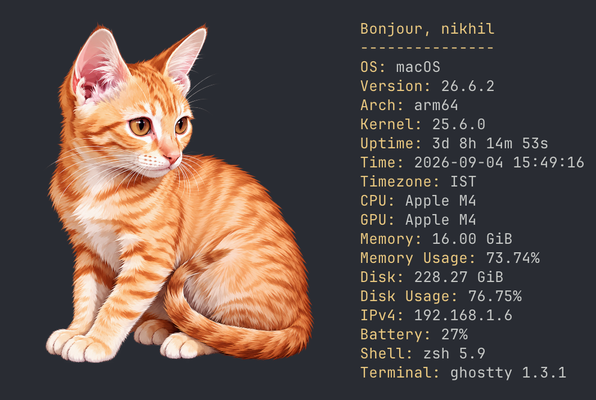
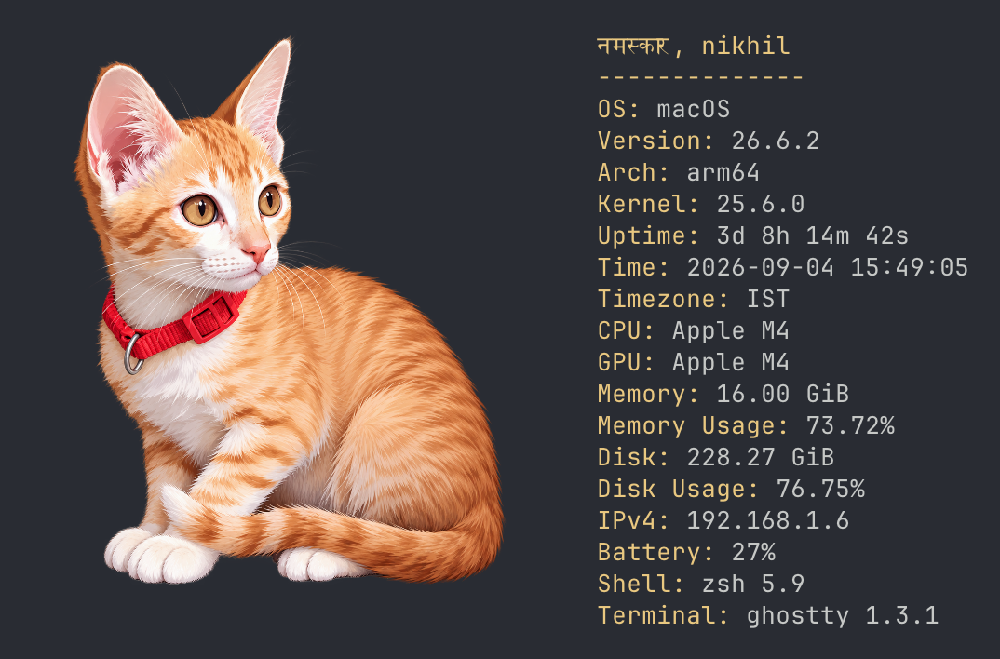
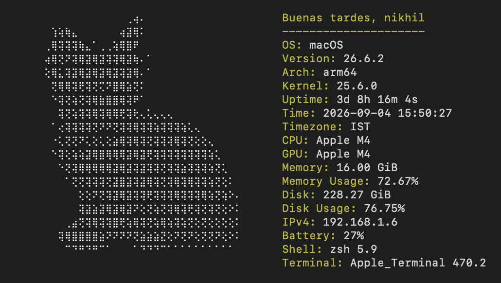
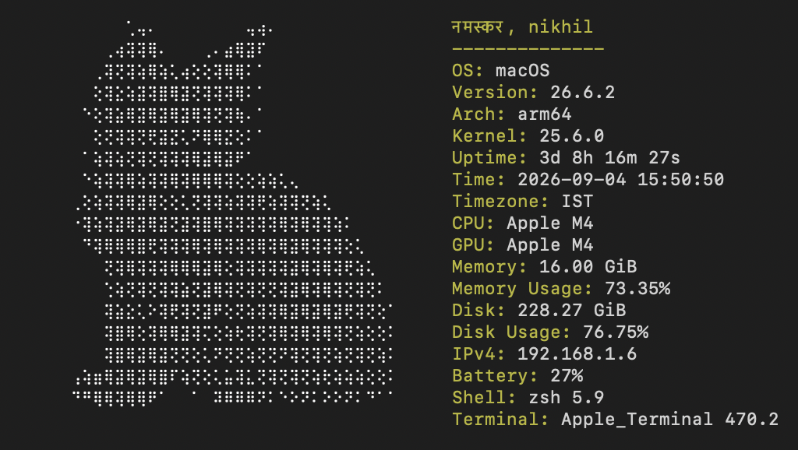

<pre align="center">

   _                                          _    
  | |                                        | |   
 / __)  _ __  _   _ _ __ _ __ _ __   ___  ___| | __
 \__ \ | '_ \| | | | '__| '__| '_ \ / _ \/ _ \ |/ /
 (   / | |_) | |_| | |  | |  | |_) |  __/  __/   < 
  |_|  | .__/ \__,_|_|  |_|  | .__/ \___|\___|_|\_\
       | |                   | |                   
       |_|                   |_|                   

</pre>

<p align="center">
  <a href="https://github.com/nikhil25803/purrpeek/actions/workflows/ci.yml"></a>
  <a href="https://github.com/nikhil25803/purrpeek/blob/main/go.mod"></a>
  <a href="https://github.com/nikhil25803/purrpeek/blob/main/LICENSE"></a>
  <a href="https://github.com/nikhil25803/homebrew-tap/blob/main/Formula/purrpeek.rb"></a>
  <a href="https://github.com/nikhil25803/purrpeek/blob/main/flake.nix"></a>
</p>

Purrpeek is a cross-platform, cat-approved CLI for quickly inspecting your operating system, hardware, storage, network, power, shell, and terminal. It supports macOS, Linux, and Windows.

Collection is best-effort: if a system detail is unavailable, Purrpeek still displays everything it collected successfully.

|                                                   Preview 1                                                    |                                                   Preview 2                                                   |
| :------------------------------------------------------------------------------------------------------------: | :-----------------------------------------------------------------------------------------------------------: |
|            **Ghostty**<br>            |            **Ghostty**<br>            |
| **macOS Terminal**<br> | **macOS Terminal**<br> |

> **Note:** Images are rendered in terminals with supported image protocols, other terminals use the Braille fallback.

## Table of contents

1. [Installation](#installation)
2. [Local setup](#local-setup)
3. [Useful commands](#useful-commands)
4. [System information](#system-information)
5. [Configuration](#configuration)
   1. [Purrpeek configuration](#purrpeek-configuration)
   2. [Greeting localization](#greeting-localization)
6. [Releasing](#releasing)

## Installation

| Package manager | Commands                                                                                                               |
| --------------- | ---------------------------------------------------------------------------------------------------------------------- |
| Homebrew        | `brew install nikhil25803/tap/purrpeek`                                                                                |
| Nix             | Install: `nix profile install github:nikhil25803/purrpeek`<br>Run: `nix run github:nikhil25803/purrpeek`              |
| AUR             | Coming soon                                                                                                            |
| Scoop           | Coming soon                                                                                                            |
| WinGet          | Coming soon                                                                                                            |
| Snap            | Coming soon                                                                                                            |
| Debian          | Coming soon                                                                                                            |
| Fedora          | Coming soon                                                                                                            |

The Nix package is currently distributed through the repository flake. Install it into your profile, or run it without installing:

```sh
nix profile install github:nikhil25803/purrpeek
nix run github:nikhil25803/purrpeek
```

Publication in the official nixpkgs repository is planned. Once merged, the shorter run command will be:

```sh
nix run nixpkgs#purrpeek
```

## Local setup

### Prerequisites

- [Git](https://git-scm.com/)
- [Go 1.26.5](https://go.dev/dl/) or a compatible version

Clone the repository:

```sh
git clone https://github.com/nikhil25803/purrpeek.git
cd purrpeek
```

Set up, test, and build the project without Make:

```sh
# macOS and Linux
./scripts/setup.sh

# Windows Command Prompt
scripts\setup.bat
```

The scripts download dependencies, run all tests, and build the executable under `bin/`. To perform the same steps manually:

```sh
go mod download
go test ./...
# macOS and Linux
go build -o bin/purrpeek ./cmd/purrpeek

# Windows
go build -o bin/purrpeek.exe ./cmd/purrpeek
```

Run the built executable with `./bin/purrpeek` on macOS/Linux or `bin\purrpeek.exe` on Windows.

## Useful commands

| Command                                  | Description                                             |
| ---------------------------------------- | ------------------------------------------------------- |
| `go run ./cmd/purrpeek`                  | Render artwork and system details.                      |
| `go run ./cmd/purrpeek --json`           | Print the complete system report as JSON.               |
| `go run ./cmd/purrpeek --verbose`        | Render normally and show collection warnings on stderr. |
| `go run ./cmd/purrpeek --json --verbose` | Print JSON and show collection warnings on stderr.      |
| `go run ./cmd/purrpeek --help`           | Show all CLI flags.                                     |
| `./scripts/setup.sh`                     | Set up, test, and build on macOS or Linux.              |
| `scripts\setup.bat`                      | Set up, test, and build on Windows.                     |
| `make test`                              | Run all Go tests.                                       |
| `make nix-check`                         | Validate and build the package with Nix.                |
| `make run-purrpeek`                      | Run Purrpeek from source.                               |
| `make build-purrpeek`                    | Build `bin/purrpeek`.                                   |

Warnings are quiet by default and written to standard error only with `--verbose`, keeping JSON output usable by other tools.

## System information

| Category         | Information provided                                                                |
| ---------------- | ----------------------------------------------------------------------------------- |
| Operating system | Username, hostname, OS name and version, kernel version, and architecture           |
| Uptime           | Human-readable uptime and boot time                                                 |
| Time             | Local time, timezone, and UTC offset                                                |
| CPU              | Model, physical and logical core counts, usage, and optional frequency              |
| GPU              | Detected graphics processor models                                                  |
| Memory           | Total, used, and available memory with usage percentage                             |
| Disk             | Home usage, mounted volumes, filesystems, mount points, capacity, and usage         |
| Network          | Primary interface, IPv4 and IPv6 addresses, MAC address, MTU, and interface details |
| Batteries        | Battery names and charge percentages when present                                   |
| Shell            | Name, version, and executable path                                                  |
| Terminal         | Name, version, `TERM`, `COLORTERM`, width, and height                               |

## Configuration

Purrpeek reads optional user files from the platform configuration directory:

| Platform | Purrpeek configuration                                      | Greeting localization                                   |
| -------- | ----------------------------------------------------------- | ------------------------------------------------------- |
| macOS    | `~/Library/Application Support/purrpeek/purrpeek-conf.yaml` | `~/Library/Application Support/purrpeek/greetings.json` |
| Linux    | `$XDG_CONFIG_HOME/purrpeek/purrpeek-conf.yaml`              | `$XDG_CONFIG_HOME/purrpeek/greetings.json`              |
| Windows  | `%AppData%\purrpeek\purrpeek-conf.yaml`                     | `%AppData%\purrpeek\greetings.json`                     |

On Linux, `$XDG_CONFIG_HOME` is normally `~/.config`. User configuration is read on every invocation, so these files do not require rebuilding Purrpeek.

### Purrpeek configuration

The YAML configuration controls which bundled images may be selected and which system fields appear in normal terminal output:

```yaml
images:
  - mongo_no_bg.png
  - snow_no_bg.png

render:
  cpu:
    model:
      name: CPU
      description: Processor model
      enabled: true
```

For each render field:

- `name` is the label displayed in the terminal.
- `description` documents what the field contains.
- `enabled` decides whether the field is rendered.

The user file is merged over the [embedded defaults](internal/conf/purrpeek-conf.yaml), so it only needs to contain values you want to change. Purrpeek randomly chooses from valid configured image names. Malformed YAML, unknown fields, and unreadable configuration files stop the command with a concise error.

Repository contributors can change the embedded YAML or add images under `internal/asset/images/`. Because these files are embedded in the executable, rebuild afterward:

```sh
make build-purrpeek
./bin/purrpeek
```

### Greeting localization

Purrpeek chooses a random available language and greeting on each run. The local time selects one of four periods:

| Period      | Local time  |
| ----------- | ----------- |
| `morning`   | 05:00–11:59 |
| `afternoon` | 12:00–16:59 |
| `evening`   | 17:00–20:59 |
| `night`     | 21:00–04:59 |

Create an optional `greetings.json` in the user configuration directory to add a language or replace phrases for an existing language and period:

```json
{
  "de": {
    "morning": ["Guten Morgen"],
    "afternoon": ["Guten Tag"],
    "evening": ["Guten Abend"],
    "night": ["Gute Nacht"]
  }
}
```

User entries merge with the bundled catalog by language and period. Phrase arrays for matching periods replace the bundled arrays, while all unspecified translations remain available. Blank and duplicate phrases are removed. Malformed JSON, unsupported period names, control characters, and unreadable files stop the command with an error.

Repository contributors can edit the [bundled greeting catalog](internal/asset/localisation/greetings.json). It is embedded at build time, so run `make build-purrpeek` before testing those changes in `bin/purrpeek`.

## Releasing

GitHub Actions and GoReleaser create release archives and checksums whenever a `v*` tag is pushed. Before each release, move completed entries from [Unreleased](CHANGELOG.md#unreleased) into a dated version in the changelog, commit that change, and then create a lightweight tag:

```sh
git switch main
git pull --ff-only
# Update and commit CHANGELOG.md
git tag v0.2.0
git push origin v0.2.0
```

Use the GitHub CLI to inspect the workflow and published release:

```sh
gh run list --workflow Release
gh release view v0.2.0
gh release view v0.2.0 --web
gh release download v0.2.0
```

Do not run `gh release create`: the tag-triggered GoReleaser workflow creates the GitHub release and its assets automatically. Release history is maintained in [CHANGELOG.md](CHANGELOG.md).

## License

Purrpeek is available under the [MIT License](LICENSE). Copyright © 2026 Nikhil Raj.
